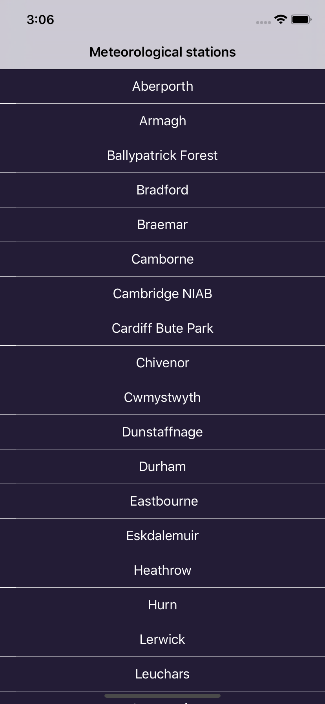
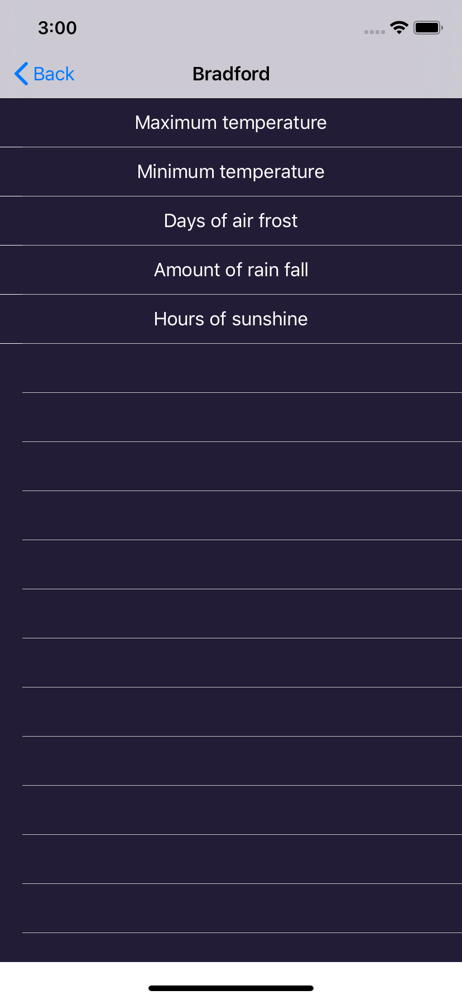
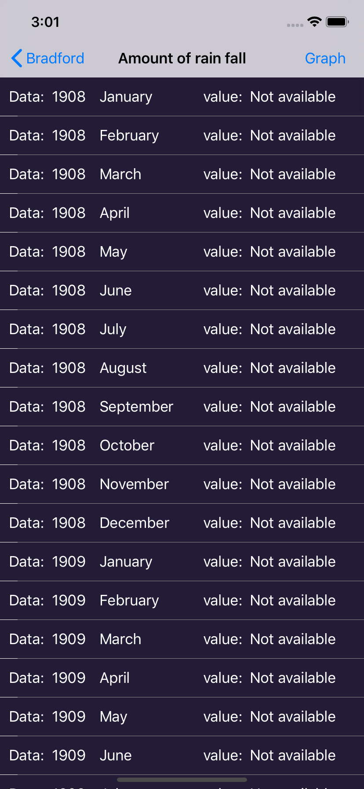
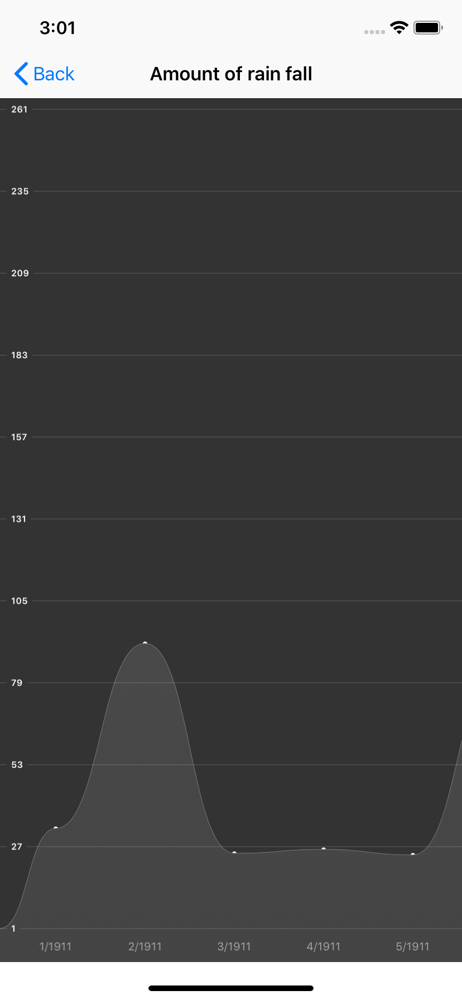

# HistoryOfWeatherTrends

iOS  Weather Trends App .

Displays a history of weather trends from a Meteorological Weather Station in TableView and GraphView

																	

To run it:

1. Clone the project 

2. Install pods with command "pod install" 

3. Open .xcworkspace file and run project on simulator or physical device

